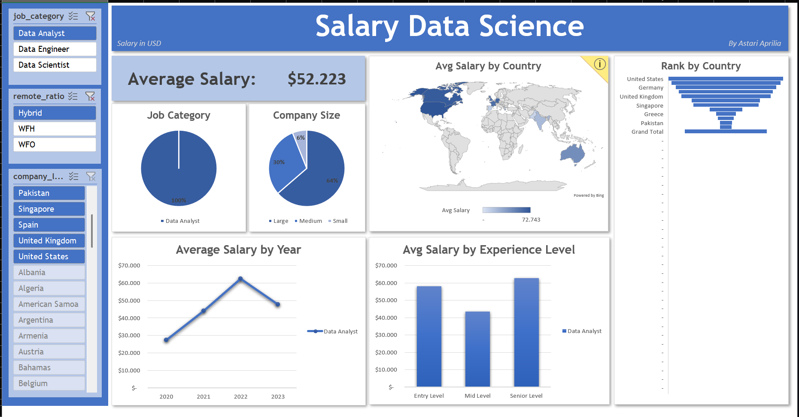

# ✨ Salary Data Science ✨

Studi Gaji Data Science: Faktor-Faktor yang Mempengaruhi Gaji di Berbagai Peran

## Project Overview

Menganalisis tren gaji di bidang data science untuk peran Data Analyst, Data Engineer, dan Data Scientist.  Memberikan wawasan mengenai faktor-faktor yang mempengaruhi gaji di berbagai lokasi dan industri.

**Scope**
- Pengumpulan Data: Mengumpulkan data gaji dari berbagai sumber.
- Analisis Data: Menganalisis data untuk menemukan pola dan tren.
- Perbandingan: Membandingkan gaji antar peran dan lokasi.
- Visualisasi Data: Membuat visualisasi data yang informatif.

**Methodology**
- Pengumpulan Data: Mengunduh data gaji dari Kaggle.
- Data Cleaning: Membersihkan dan memvalidasi data.
- EDA (Exploratory Data Analysis): Melakukan analisis eksploratif.
- Visualisasi: Membuat visualisasi data dengan Tableau

**Expected Outcomes**
- Laporan Gaji: Laporan komprehensif yang merinci tren gaji di bidang data science.
- Dashboard Interaktif: Dashboard yang memungkinkan pengguna untuk mengeksplorasi data gaji berdasarkan berbagai kriteria.
- Rekomendasi: Rekomendasi untuk pemberi kerja dan profesional mengenai strategi kompensasi yang kompetitif dan adil.

**Conclusion** 
Proyek ini akan memberikan wawasan mendalam mengenai dinamika gaji di bidang data science, membantu para profesional dalam merencanakan karier mereka dan membantu pemberi kerja dalam menetapkan kebijakan gaji yang sesuai.

✨ **Tableau Dashboard**

✨ **Excel Dashboard**

